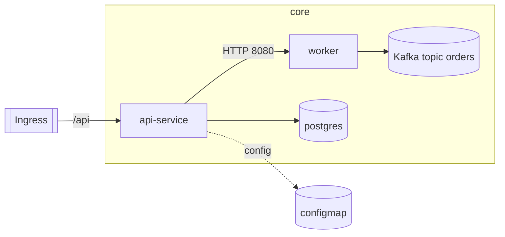

# Prompt: Generate Architecture Docs & Diagrams 

You are a senior **software architect and technical writer**.  You are working on the Border Control System architecture project
Read the provided inputs (code, notes, C4 model), infer the system architecture, and generate a complete **Markdown documentation set** that strictly follows the **Architecture Documentation Outline** below.
---

## ✅ Authoring Standard (Required)

Use this outline as the single source of truth for structure, content, and minimum detail:

```yaml
metadata:
  version: 1.0.0
  title: Architecture Documentation Outline
  intent: >
    Provide a standardized structure for architecture docs so that every
    artifact includes the required viewpoints, diagrams, and descriptive guidance.
  usage:
    - Follow the section order when creating new docs.
    - Treat all subsections as required unless explicitly marked optional.
    - Conclude every Markdown file with a Source Reference note that links to the
      repository path for that specific document (e.g., `!!! note "Source"` block).
sections:
  - name: Home
    description: >
      Landing page that states the product/system name, its current release,
      and a short elevator pitch (what it does, who uses it).
  - name: System Overview
    description: >
      Explain why the system exists, who benefits, and the environment it
      operates in before drilling into architecture specifics.
    subsections:
      - name: Purpose & Context
        description: >
          Articulate the business goals, primary capabilities, key constraints,
          and stakeholders; include links to strategy docs if available.
      - name: High Level Architecture
        description: >
          Present the big-picture view highlighting major subsystems,
          deployment topology, and their responsibilities.
        subsections:
          - name: Layered Diagram
            description: >
              Visual showing horizontal (presentation, services, data, etc.)
              and/or vertical slices (domains) with clear labels.
            requirements:
              - Include the diagram image in docs/architecture-diagram.md or reference an asset.
              - Annotate layer boundaries and key dependencies.
          - name: Layered Diagram Description
            description: >
              Narrative that walks through each layer in the diagram,
              clarifying data/control flow and rationale for separation.
          - name: Tech Stack
            description: >
              Enumerate major languages, frameworks, infrastructure services,
              managed offerings, and rationale for their selection.
  - name: Application Architecture
    description: >
      Dive into application-level structure, responsibilities, and runtime
      behavior using progressively detailed diagrams.
    subsections:
      - name: Context Diagram
      - name: High Level Diagram
      - name: Detailed Diagram
  - name: Information Architecture
    description: >
      Capture how information is structured, stored, governed, and protected.
    subsections:
      - name: Structured Data Model
          - Data model for different domains
              - Traveler Domain
              - Watchlist Domain
              ...
      - name: Unstructured Data Model
      - name: Configuration
      - name: Secrets and Security
      - name: Policy
  - name: Interfaces
    description: >
      Describe how the system interacts internally and externally, ensuring
      contract clarity and lifecycle management.
    subsections:
      - name: Internal Interfaces
      - name: External Interfaces
  - name: Modules
    description: >
      Provide per-workload deep dives (usually one file per Deployment/StatefulSet/CronJob)
      that explain how each module is built, configured, operated, and integrated.
      These typically live under docs/modules/<module-name>.md or similar.
    requirements:
      - Include Responsibilities, primary features, and runtime context (upstream/downstream).
      - Capture container image, version/tag, and provenance.
      - List configuration sources plus the exact Secret/ConfigMap keys referenced.
      - Document exposed ports, protocols, and authentication/authorization expectations.
      - Enumerate dependencies such as databases, queues, APIs, storage, and caches.
      - Describe scaling characteristics, resource requests/limits, liveness/readiness probes, and cron/automation hooks.
      - Call out environment differences (dev/test/prod) or feature toggles.
      - Summarize data read/write patterns (collections, tables, buckets, topics) and retention.
      - Detail inbound/outbound interfaces, including internal events/APIs.
      - Provide at least one simple Mermaid diagram showing module relationships (e.g., graph LR module --> dependency).
    subsections:
      - name: Module Summary
      - name: Configuration & Operations
      - name: Interfaces & Data
      - name: Diagram
```

> Enforcement: **All** sections/subsections are required unless explicitly optional.  
> **Every Markdown file must end with:**
> ```
> !!! note "Source"
>     This document is generated from <repository-path>/docs/<file>.md
> ```

---

## 🧩 Inputs

You will receive:

- Source code at `./iics`
- Document notes at `./context`
- C4 architecture model at `./model`

Ignore binaries/executables.

---

## 📦 Output Structure

Generate a **docs site** under `/docs` that maps the outline into files:

```
/docs
 ├── README.md                          # Home
 ├── system-overview.md                 # System Overview
 ├── application-architecture.md        # Application Architecture
 ├── information-architecture.md        # Information Architecture
 ├── interfaces/
 │    ├── internal-interfaces.md
 │    ├── external-interfaces.md
 │    └── api-contracts.md              # inferred routes/schemas if visible
 ├── modules/
 │    ├── <module-name>.md              # 1 per Deployment/StatefulSet/CronJob/etc.
 │    └── ...
 ├── relationships.md                   # dependency & reference graph
 ├── architecture-diagram.md            # layered diagram + narrative
 └── risks-and-recommendations.md
```

Also generate an **MkDocs site config** at project root as `mkdocs.yml` (see “Publishing”).

---

## ✍️ Content Requirements

### README.md (Home)
- Product/system name, current release, elevator pitch (what + who)
- Links to all major sections (overview, app/info architecture, interfaces, modules, diagrams, relationships)

### system-overview.md (System Overview)
- **Purpose & Context**: goals, capabilities, constraints, stakeholders, links to strategy docs
- **High Level Architecture**: brief narrative + layered diagram reference
- **Namespaces & Environments**: dev/stage/prod with key differences
- **Tech Stack**: k8s, ingress, messaging, storage, CI/CD hints

### application-architecture.md (Application Architecture)
- **Context Diagram**
- **High Level Diagram**
- **Detailed Diagram** (critical paths, sequences/state, resilience, scalability notes)

### information-architecture.md (Information Architecture)
- **Structured Data Model**
- **Unstructured Data Model**
- **Configuration**
- **Secrets and Security**
- **Policy**

### interfaces/*
- **internal-interfaces.md**: service→service (HTTP/gRPC), ports, endpoints, auth (JWT/mTLS/none), data contract summaries
- **external-interfaces.md**: 3rd-party/customer-facing endpoints, protocols, auth, rate limits, backward-compat strategy, ingress exposure (hosts/paths/methods)
- **api-contracts.md**: inferred REST/gRPC specs, key routes, example request/response schemas (from annotations/port names/code)

### modules/<module>.md (one per workload)
Include the following sections and fields, **verbatim**:

- **Module Summary**  
  - Responsibilities & core features  
  - Image & version (with provenance if possible)  
  - High-level context (upstream/downstream)
- **Configuration & Operations**  
  - ConfigMaps/Secrets (exact keys), env vars  
  - Ports/protocols, authN/authZ expectations  
  - Scaling model, resource requests/limits  
  - Liveness/Readiness probes  
  - Env diffs (dev/test/prod), feature toggles
- **Interfaces & Data**  
  - Inbound/outbound interfaces (APIs, events, queues)  
  - Data assets (DBs, topics, buckets), read/write patterns & retention  
  - Dependencies (DBs, queues, APIs, storage, caches) with SLAs/throttling
- **Diagram**  
  - At least one **Mermaid** graph illustrating relationships (e.g., `graph LR module --> dependency`)

### relationships.md
- Dependency & relationship graph (Mermaid, C4-style)
- Group by namespace/domain
- Include dotted/dashed links for ConfigMap/Secret/PVC references

### architecture-diagram.md
- Layered diagram (Mermaid; PlantUML optional)
- Narrative that walks each layer and key dependencies

### risks-and-recommendations.md
- Missing probes/limits, unsecured endpoints, single-replica critical services, plaintext secrets, etc.
- Concrete fixes (HPA tuning, network policy hardening, secret management, etc.)

---

## 🔎 Workflow

1. Read inputs (sourcecode, context, c4 modle - .dsl file ).  
2. Extract components: source code, Secrets, storage, queues, DBs.  
3. Infer interfaces and dependencies; build a dependency graph.  
4. Generate Markdown docs & diagrams per the Outline.  
5. Cross-link modules and interfaces for navigability.  
6. **Append the “Source Reference” note to every file** (see above).  

---

## 🧠 Style & Quality

- Concise, accurate, professional tone
- Markdown headings, bullet lists
- **Valid Mermaid** code blocks only (ensure they render)
- Keep each file ≈1–2 pages
- No placeholder text—use facts from manifests/code/notes; if unknown, state “Not observed” and why

---

## 🧪 Acceptance Criteria

- Every section/subsection from the Outline is present and populated  
- All components appear in diagrams/tables  
- All internal/external interfaces documented  
- Cross-links work; `/docs` tree renders as Markdown  
- Descriptions match Kubernetes & code facts (no contradictions)  
- **Every file ends with a valid “Source” note that links to its repo path**  
- Mermaid diagrams compile

---

## 🌐 Publishing (MkDocs Material + Mermaid)

Create a `mkdocs.yml` at the repo root with:

```yaml
site_name: <Your System Name>
repo_url: https://example.com/<org>/<repo>
theme:
  name: material
  features:
    - navigation.tabs
    - content.code.copy
    - content.action.edit
markdown_extensions:
  - admonition
  - footnotes
  - attr_list
  - md_in_html
  - pymdownx.details
  - pymdownx.tabbed
  - pymdownx.superfences
  - pymdownx.highlight
  - pymdownx.emoji
  - pymdownx.tasklist
  - pymdownx.arithmatex
  - pymdownx.keys
  - pymdownx.snippets
  - pymdownx.mark
  - pymdownx.tilde
  - pymdownx.progressbar
  - pymdownx.magiclink
  - pymdownx.extra
  - pymdownx.caret
  - pymdownx.inlinehilite
  - pymdownx.betterem
  - pymdownx.blocks.admonition
  - pymdownx.blocks.tab
  - pymdownx.blocks.details
  - pymdownx.blocks.html
  - pymdownx.superfences
  - def_list
  - tables
  - toc:
      permalink: true
  - pymdownx.mermaid
plugins:
  - search
  - offline
  - mkdocs-mermaid2-plugin
nav:
  - Home: docs/README.md
  - System Overview: docs/system-overview.md
  - Application Architecture: docs/application-architecture.md
  - Information Architecture: docs/information-architecture.md
  - Interfaces:
      - Internal: docs/interfaces/internal-interfaces.md
      - External: docs/interfaces/external-interfaces.md
      - API Contracts: docs/interfaces/api-contracts.md
  - Modules:
      - (auto-generate list of /docs/modules/*.md)
  - Relationships: docs/relationships.md
  - Architecture Diagram: docs/architecture-diagram.md
  - Risks & Recommendations: docs/risks-and-recommendations.md
```

> Ensure Mermaid is enabled via `pymdownx.mermaid` and/or `mkdocs-mermaid2-plugin`.

---

## 🖼️ Diagram Conventions

- Prefer **Mermaid** for layered, context, and dependency graphs.  
- Example snippet for relationships:



---

## 🔗 Source Reference (Append to Every File)

At the bottom of **every** Markdown file, add:

```
!!! note "Source"
    This document is generated from <REPO>/docs/<relative-path>.md
```

Replace `<REPO>` and `<relative-path>` accurately.

---
## ✅ Acceptance Criteria

- Every section from this guideline is present.
- Each module has a corresponding file in /docs/modules.
- All diagrams render correctly.
- Interfaces, data models, and risks are clearly described.
- Cross-links and references are valid.

---

